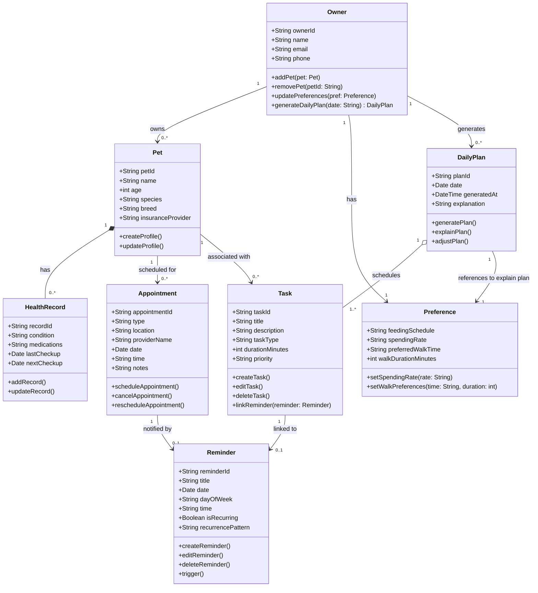

# PawPal+ Class Diagram

## Class Responsibilities

| Class | Responsibility |
|---|---|
| **Owner** | Central actor — owns pets, holds preferences, triggers daily plan generation |
| **Pet** | Pet profile (species, breed, insurance); links to health records and appointments |
| **HealthRecord** | Stores medical conditions, medications, and checkup history (composition of Pet) |
| **Preference** | Owner's care preferences (food, spending, walk timing) used by the AI planner to justify its choices |
| **Task** | A single care activity (walk / feed / groom / vet visit) with duration and priority; links to a Reminder |
| **Reminder** | Date/time alert for a Task or Appointment; supports one-off and recurring schedules |
| **Appointment** | Vet or grooming bookings with their own Reminder for notifications |
| **DailyPlan** | AI-generated schedule for a day; selects and orders Tasks based on Preferences and explains why |

## Relationship Legend

- `*--` Composition — HealthRecord cannot exist without Pet
- `o--` Aggregation — DailyPlan contains Tasks but Tasks exist independently
- `-->` Association — navigable reference between classes
