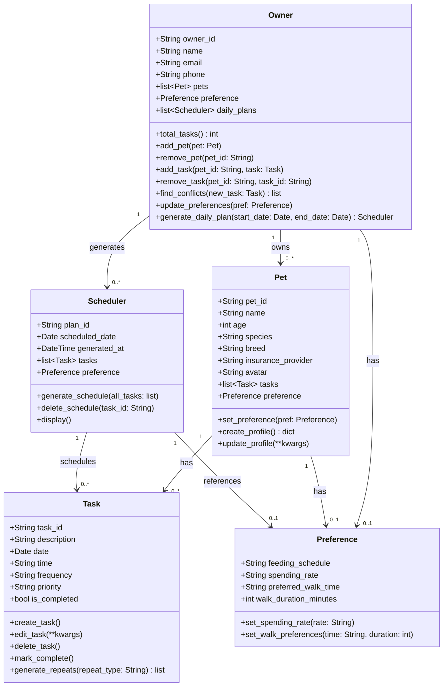

# PawPal+ Class Diagram

## Class Responsibilities

| Class | Responsibility |
|---|---|
| **Owner** | Central actor — owns pets, manages tasks across all pets, detects scheduling conflicts, triggers daily plan generation |
| **Pet** | Pet profile (name, species, breed, insurance, avatar); holds its own task list and care preferences |
| **Task** | A single care activity with date, time, priority, frequency, and completion status; can generate the next occurrence |
| **Scheduler** | Filters and sorts all pet tasks for a given date by time and priority; stores the generated daily plan |
| **Preference** | Per-pet care preferences (feeding, spending, walk timing) set independently for each pet |

## Relationship Legend

- `-->` Association — navigable reference between classes
- `"1" --> "0..*"` One-to-many (e.g. one Owner has zero or more Pets)
- `"1" --> "0..1"` One-to-optional (e.g. a Pet may or may not have a Preference set)
